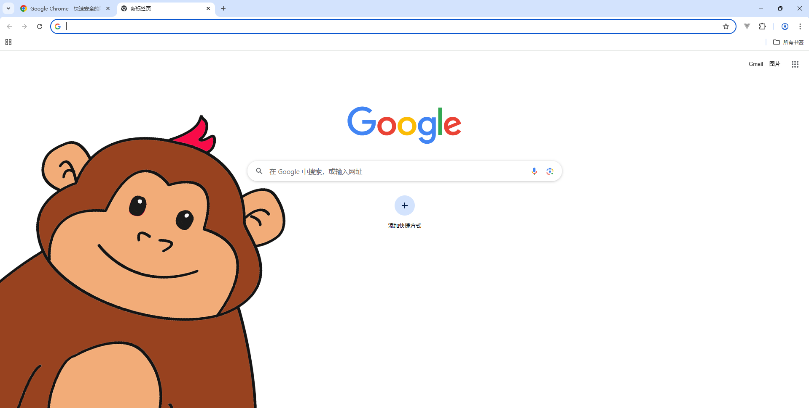
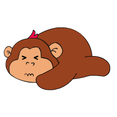

# Gorilla Desktop Pet

**Gorilla Desktop Pet** is a cute, interactive desktop companion built with Electron.  
It features energy tracking, feeding animations, draggable states, and popup windows like todo, note, and chat.  
It also supports **offline AI chat** via local models such as RWKV or Ollama.



---

## Features

- Energy system (with battery and exhausted states)
- Feeding animation (banana, cola, yogurt)
- Chat window (RWKV / Ollama support)
- Todo list window
- Note-taking window
- Dragging animation (struggle)
- Works fully offline
- Modular architecture, easy to expand

---

## Download

> **Large files like `ollama.exe` and models are NOT included in this repo** due to GitHub size limits.

### You must manually place them like this:

```
src/
├─ ollama/
│   ├─ ollama.exe            # Ollama executable
│   └─ models/               # Your RWKV or other models
```

- [Download Ollama Executable](https://ollama.com/)

> After installing Ollama, use `ollama run` to download your desired model  
> (e.g. `ollama run llama3`).  
> Then, manually locate the downloaded model folder:

```
Windows: C:\Users\<YourName>\.ollama\models
macOS/Linux: ~/.ollama/models
```

> Copy the entire model folder into:  
> `src/ollama/models/`

中文说明：

下载 Ollama 主程序后，请使用命令 `ollama run 模型名`（如 `ollama run llama3`）下载模型。  
模型通常保存在用户主目录的 `.ollama/models` 中，下载完成后请将模型复制到项目内的 `src/ollama/models/` 文件夹中。

- [模型命令参考：ollama run llama3](https://ollama.com/library)

---

## Getting Started

### 1. Install dependencies

```bash
npm install
```

### 2. Place the required executable and models

Place your `ollama.exe` and model files under `src/ollama/`  
将 `ollama.exe` 与模型文件手动放入 `src/ollama/` 文件夹中。

### 3. Start the app

```bash
npm start
```

> If you use local AI, make sure your local server is started first (e.g. Flask / Ollama backend).

---

## Project Structure

```
src/
├─ assets/           # Images / GIFs (eating, exhausted, etc.)
├─ features/         # Chat, todo, note sub-windows
├─ renderer/         # Main UI & pet interaction
├─ ollama/           # Holds ollama.exe and models
├─ preload.js        # Secure API bridge
├─ main.js           # Electron main process
```

---

### Gorilla on Desktop

> Interactive with your desk pet!


---

## Packaging

To build the `.exe` or `.dmg` app:

```bash
npm run build
```

> Requires configuration via `electron-builder` in `package.json`

---

## License

MIT License © 2025 [WineGorilla](https://github.com/WineGorilla)
